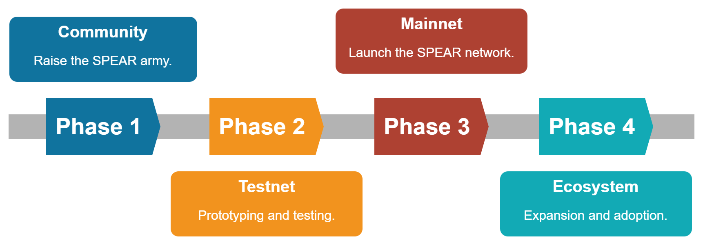

# Roadmap

<figure><figcaption>
SPEAR Roadmap
</figcaption></figure>

### Phase 1: Community

To kickoff the SPEAR project, we will find and bring together similar-minded individuals that believe the SPEAR mission - boost the crypto revolution by advancing real-world adoption through solving for scalability and stability, to create a strong community that will support, nurture, and build on top of the SPEAR protocol.

_Sub-Collection Release:_ [The Vanguard](https://docs.spear.technology/spear-dory-nft/whitepaper/supply-schedule#the-vanguard)

### Phase 2: Testnet&#x20;

Develop and initiate the SPEAR test network (testnet) to demonstrate the capabilities of the SPEAR protocol in terms of scalability, security, and decentralization. The SPEAR community will have an exclusive access to all development updates and beta releases. We will also be leaning on the community to provide critical feedback, usability testing, and bug reporting.

_Sub-Collection Release:_ [The Lochos Stage 1](https://docs.spear.technology/spear-dory-nft/whitepaper/supply-schedule#the-lochos)

### Phase 3: Mainnet

Launch the main network (mainnet) once testing and audits are done for the testnet. Prior to this, we will activate an NFT bridge on the Ethereum network to allow Dory holders to stake their NFTs and become the pioneer Governance and Consensus delegates on the SPEAR network. We will also set up the RToken stablecoin that would be used as the native token for the shard chain(s). Lastly, we will break the soul binding of the Dory eSBTs allowing the owners to transfer or trade their NFTs if they so wish.

_Sub-Collection Release:_ [The Lochos Stage 2](https://docs.spear.technology/spear-dory-nft/whitepaper/supply-schedule#the-lochos) and [The Immortals](https://docs.spear.technology/spear-dory-nft/whitepaper/supply-schedule#the-immortals)

### Phase 4: Ecosystem

Promote the SPEAR protocol and expand the network's reach through marketing and partnerships to gain real-world adoption. The short-term goal is for SPEAR's RToken to be listed on [Reserve's RPay](https://medium.com/reserve-currency/looking-ahead-the-roadmap-of-reserve-protocol-a8c5edec2fc6) giving easy access to the thousands of users and merchants on their platform. Achieving these objectives will be handed over to the SPEAR DAO who will control the funds from the final Dory NFT release.

_Sub-Collection Release:_ [The Lochos Stage 3](https://docs.spear.technology/spear-dory-nft/whitepaper/supply-schedule#the-lochos)
