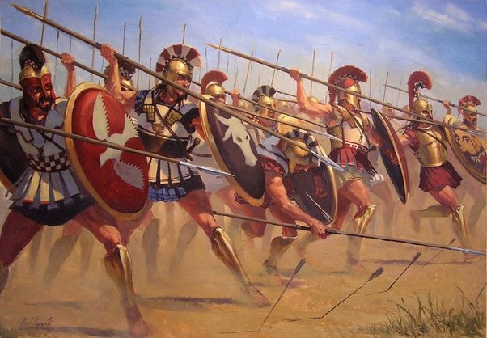

# Introduction

Dory, which means "spear" in ancient Greek, was the primary weapon of the Spartans. It was about 2.4 meters long and was mostly used for thrusting, but the razor sharp edges could also be used for slashing. The Spartan army used it to great effect in their shield wall formation called the Phalanx. The Dory was a symbol of military power during their time, with an elevated status compared to swords. In fact, Homer used the expression "Troy conquered by dory" in his epics.

<figure><figcaption>
Spartan Dory in Battle
</figcaption></figure>

Like Spartans, the Dory NFT will be the primary weapon of the SPEAR DAO in defending the security and decentralization of the SPEAR network. Unlike any other NFT project before it, Dory is both a rare collectible and a utility token. It allows the holder to own a piece of history as it marks the genesis of the Chronicle Chain - the shared view of history in the SPEAR network. A Dory NFT is also purposely functional and is essential to the architecture, tokenomics, and operation of the SPEAR protocol.&#x20;

We consciously decided to bootstrap this project via NFT crowdfunding for two reasons:

1. Starting the right way by giving control and ownership of the network to the people.
2. Avoid VC funding in the beginning that may lead to unintended centralization tendencies.

The SPEAR Dory Collection is limited to 33,300 algorithmically created and hand-drawn NFTs on the Ethereum blockchain. There won't be another NFT collection released after the SPEAR mainnet is launched for the security of the SPEAR network itself. However we might release extra collectibles in the future to allow Dory owners to upgrade their NFT's armor, weapons, and governance voting power.
