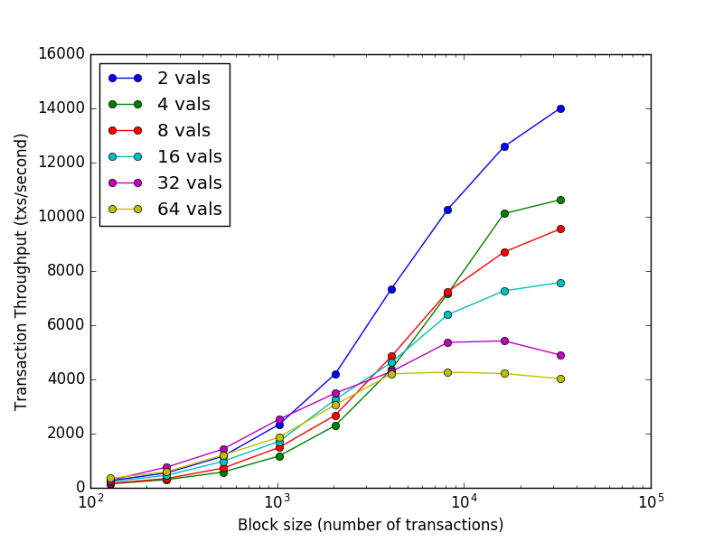

# Consensus

### Kerberos

Kerberos refers to the collection of three consensus mechanisms for each of the three layers of the SPEAR protocol. These consensus mechanisms work on top of each other, linking the DC system with one or more DS system as outlined in the SPEAR Protocol's [architecture](https://lycurguz.gitbook.io/spear/spear-protocol/whitepaper/architecture) to ensure the consistency of the network. We discuss the design considerations for Kerberos as well as its advantages and disadvantages in [Security](https://lycurguz.gitbook.io/spear/spear-protocol/whitepaper/miscellanea#security).\

<figure><figcaption>
Kerberos Diagram
</figcaption></figure>

### Tendermint

Tendermint is a partially synchronous BFT consensus protocol that is notable for its simplicity, performance, and fork-accountability. In the SPEAR Protocol, Tendermint is used in the Mora layer by Block Producers for high-throughput block production with instant finality.

Please see the [Tendermint Documentation](https://docs.tendermint.com/) for more details on how Tendermint functions and the security guarantees it provides.

<figure><figcaption>
Source: <a href="https://github.com/cosmos/cosmos/blob/master/WHITEPAPER.md#tendermint">Cosmos Whitepaper</a>
</figcaption></figure>

### Spearmint&#x20;

Spearmint is a modified implementation of Tendermint that allows the Stratos layer to provide shared security across one or more Execution Chains. A brief summary of the modifications are outlined below:

* Changes in the signature and encoding scheme to allow verification using an EVM-compatible smart contract.
* Validators that staked a fixed amount of collateral on the Apella layer could be randomly chosen as a Witness in a committee to oversee a given Execution Chain for a specific period.
* The size of the committee will be between 100 and 300 Witnesses that would be set when an Execution Chain is launched or modified via voting of Governance participants.

Aside from these changes, Spearmint shall function in the same way as in Tendermint where Witnesses vote in two stages per round to propose and eventually commit a superblock (a summary of multiple Mora-layer blocks) at a given block height.&#x20;

<figure><figcaption>
Source: <a href="https://docs.tendermint.com/">Tendermint Documentation</a>
</figcaption></figure>

### Khimaira

A PoW/PoS hybrid consensus mechanism for the Apella layer, a DC system implemented as the Chronicle chain, which is a longest-chain protocol that aims to combine the best features of Proof of Work (PoW) and Proof of Stake (PoS). Below is a brief summary of the advantages of Khimaira compared to conventional PoW and PoS:

* Increased security against 51% attacks which would require a malicious actor on average to have 51% of the hashing power in the network as well as owning 51% of the staked tokens.
* Avoids weak subjectivity which protects the network from nothing-at-stake vulnerabilities such as long range attacks and hardens the immutability of the blockchain over time.
* Less energy requirements per unit of security afforded by the PoS component of Khimaira.
* The PoW component of Khimaira provides a good source of randomness for selecting validators, witnesses, and block producers.
* Improved recovery in the event of a 51% attack as a counter-attack is available to the honest minority who have the ability to soft-fork the blockchain and slash all the staked tokens of the attacker.

Consensus participants, the miners for PoW and the validators for PoS, provide defensive resources for Sybil resistance and protection against attacks such as double-spending. The block creation process in Khimaira is as follows:

1. Upon receiving a valid block, a PoW miner begins building a new block (B) with a block header that includes the hash of the previous block, the miner’s public address, height (H) relative to the genesis block, the current difficulty, and a nonce. This new block also references a PoS Transaction Heap (TX), by including its Merkle root in the block header, that is created by one of three validators derived by the previous block.&#x20;
2. The PoW miner then uses it's hashpower to find a nonce such that the hash of the new block satisfies the current network difficulty. If a valid nonce is found, the block is inserted into the blockchain and the PoW miner broadcasts the new block to the network.&#x20;
3. All the network nodes regard the hash of this block as data that deterministically derives 3 validators based on the current list of public addresses in the staking smart contract. The derivation is done by concatenating this hash with the hash of the previous block and the genesis block, then hashing the combination, and then invoking an algorithm that generates a value that chooses three validators based on their staking position or index on the list.
4. Every validator checks whether the block received is valid, meaning that it contains the hash of the previous block, meets the current difficulty, and contains a valid PoS Transaction Heap. Upon validation, validators check whether they are one of the three derived PoS validators for this block tasked to create a Transaction Heap.&#x20;
5. The three winners of this lottery are given a priority number based on the derivation algorithm. If a derived validator is online, it would create a Transaction Heap filled with validated transactions (governance, non-governance, shard superblock data) and is signed using the validator's private key, which is then propagated to the network.
6. Another PoW miner tries to extend the longest branch of the blockchain that they are aware of, where “longest” is measured in PoW difficulty as in Bitcoin. The miner can select any of the three Transaction Heaps to be used for a new block. The reward that a PoW miner would receive if a new block is found depends on the Transaction Heap's priority number. PoW miners would prefer valid Transaction Heaps that have the highest priority available to maximize their reward.
7. Go to 1.

<figure><figcaption>
Khimaira Block Production
</figcaption></figure>
