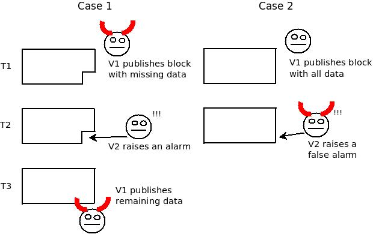

# Miscellanea

### Security

TO DO:

* [ ] Describe [Proof of Work vs Proof of Stake](https://kraken.docsend.com/view/58b6xidjxk44xedc) trade-offs
* [ ] Compare Khimaira with PoW and PoS
  * [ ] Security budget - more expensive to do 51% attack
  * [ ] [Ability to recover](https://docs.ethhub.io/ethereum-roadmap/ethereum-2.0/proof-of-stake/#what-would-the-equivalent-of-a-51-attack-against-casper-look-like) from 51% attack
  * [ ] More robust randomness beacon
* [ ] [Calculations ](http://www.cs.technion.ac.il/\~idddo/PoAslides.pdf)of improved security

<figure><figcaption>
Source: <a href="http://www.cs.technion.ac.il/~idddo/PoAslides.pdf">Proof of Activity</a>
</figcaption></figure>

### Sustainability

TODO:

* [ ] Outline the _Hot Gates Protocol_ which is responsible for capping the energy requirements of the PoW component of Khimaira and to keep it proportional to the actual usage and adoption of the SPEAR network.

### Data Availability

In a sharded network, not all validators will have a copy of each execution chain as that would defeat the purpose of sharding in the first place. This gives rise to the [fisherman's dilemma](https://github.com/ethereum/research/wiki/A-note-on-data-availability-and-erasure-coding) otherwise known as the data availability problem - "not publishing data is not a uniquely attributable fault". In the case of the two scenarios below that uses fraud proofs, any node that becomes aware of the alarm only recently would not be able to tell whether it is the publisher or the fisherman that is malicious.

<figure><figcaption>
Source: <a href="https://github.com/ethereum/research/wiki/A-note-on-data-availability-and-erasure-coding">Ethereum Research</a>
</figcaption></figure>

In the case of the SPEAR network, we are able to combat this for the Mora layer because the Stratos layer is explicitly designed to keep an eye on the block production process. All blocks created on the Block Production Chain are required to be submitted to the Checkpoint Chain for checking. If 1/3+ Block Producers are malicious and decide to withhold the publishing of block data, the Witnesses in the committee can vote to quarantine the suspected Block Producers so that they cannot become the block proposer during this epoch. The committee can then submit a proposal to slash the collateral of these Block Producers to be voted by Governance participants on the Apella layer.

The next problem is how we get around the data availability problem for the Stratos layer. Even though it is much more difficult for a malicious attacker to take control of a Witness committee for one particular shard by implementing [random sampling](https://vitalik.ca/general/2021/04/07/sharding.html) with an uncapped number of potential validators that can be selected to be part of a committee, it is still not impossible for an adaptive adversary to control 1/3+ of Witnesses in a committee. To solve this we require the committee of each shard to submit transactions data together with attestations from the members of the committee as _superblocks_ to the Chronicle Chain in such a way that it doesn't increase the storage burden of the nodes on the Apella layer. This would function as follows:

1. A member of the committee is chosen as the block proposer for a particular round to collect and verify a number of blocks produced for a particular shard's block production chain.
2. Using the Spearmint consensus mechanism, other Witnesses in the committee vote for the validity of this superblock by submitting attestations - digital signatures using their private key.
3. When a superblock receives attestations from 2/3+ of Witnesses, this superblock is then committed to their Checkpoint Chain.
4. The Witness that created the superblock also uploads it to a decentralized storage provider (either IPFS or Arweave) and submits the pointer to the Chronicle Chain including the pointer to the previous superblock.
5. All other capable nodes can review the provided superblocks on the Chronicle Chain and submits a proposal to slash potentially malicious actors via voting of the Judicial Governance committee.
